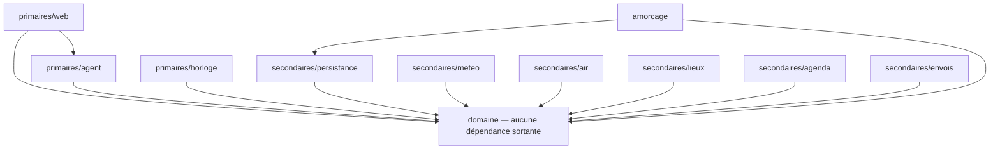
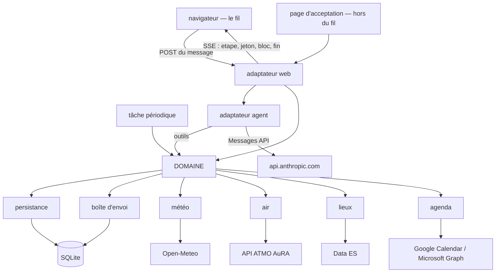
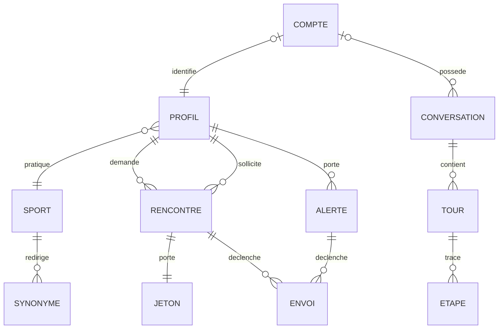

# Architecture Spine — Ex Aequo

## Design Paradigm

**Hexagonal — ports et adaptateurs.** Le domaine est au centre et ne dépend de rien. Tout
le reste est un adaptateur : le web, l'agent LLM, la persistance, les quatre services
tiers, la boîte d'envoi.

Le nom porte l'invariant central du produit : **le LLM est un adaptateur primaire, au même
titre que le navigateur.** Il traduit du langage naturel vers des appels de domaine et rend
la réponse en prose. Il n'est pas le noyau, et rien de ce que le produit tient pour vrai ne
transite par la génération.

| Couche | Répertoire | Dépend de |
| --- | --- | --- |
| Domaine | `exaequo/domaine/` | rien |
| Adaptateurs primaires | `exaequo/adaptateurs/primaires/` | le domaine |
| Adaptateurs secondaires | `exaequo/adaptateurs/secondaires/` | le domaine |
| Amorçage | `exaequo/amorcage/` | le domaine, la persistance |

## Invariants & Rules



Une flèche se lit « importe ». Le domaine n'en émet aucune : il déclare des protocoles dans
`domaine/ports.py`, et les adaptateurs les implémentent.

### AD-1 — Le LLM ne produit aucun fait

- **Binds:** `all`
- **Prevents:** qu'une règle chiffrée du PRD devienne probabiliste, et que SM-2 — « le bot
  ne produit jamais un nom, un lieu ou une météo qui ne vienne pas d'une source réelle » —
  devienne invérifiable par construction.
- **Rule:** le modèle ne produit que trois choses : l'extraction d'une demande en langage
  naturel (FR-2), le choix de l'outil à appeler, et la prose. Aucun nom de candidat, aucune
  valeur météo, aucun lieu, aucun statut n'est produit par la génération : ils sont calculés
  par le domaine et rendus tels quels. Aucun module du domaine n'importe le SDK Anthropic.

### AD-2 — Un seul saut LLM par tour

- **Binds:** NFR de latence (2 s / 20 s), FR-2
- **Prevents:** la latence cumulée d'une chaîne d'agents dans une interface où quelqu'un
  attend devant un curseur.
- **Rule:** un tour de parole est une seule boucle de *tool runner*. Aucun outil n'émet
  d'appel LLM imbriqué, et il n'existe ni routeur ni agent spécialisé en amont.

### AD-3 — Les lignes d'étape sont émises par la couche d'appel d'outil

- **Binds:** PRD §7 (*les étapes annoncées correspondent aux sources réellement
  interrogées*), NFR de latence
- **Prevents:** qu'une étape annoncée ne corresponde à aucun appel réel, et qu'un appel en
  échec reste affiché sans démenti.
- **Rule:** chaque port **qui peut échouer d'une façon que la personne doit connaître** émet un
  événement `etape` à l'entrée et à la sortie de l'appel, portant le service et son sort. Cinq
  ports satisfont ce critère : `meteo`, `air`, `lieux`, `agenda` et `envois` — ce dernier parce
  que le filtre de destinataire échoue bruyamment par conception (FR-14) et que ne pas avoir pu
  prévenir le partenaire est une conséquence que le produit s'inflige, donc qu'il écrit.
  `persistance` n'émet pas : son échec n'est pas un fait mais un **défaut**, au sens de la
  section *Consistency Conventions*. Le modèle ne dispose d'aucun outil lui permettant d'émettre
  une étape. Corollaire tenu gratuitement : le signe de vie part au premier appel d'outil, avant
  le premier jeton du modèle.

  > *Corrigé le 2026-08-31.* La règle disait « chaque **port secondaire** », là où le SPEC
  > (CAP-16, *intent*) disait « chaque **appel externe** » — deux listes différentes, la
  > persistance et la boîte d'envoi étant des ports secondaires **locaux**. Deux constructeurs
  > conformes produisaient deux fils incompatibles. Le critère est désormais énoncé par principe
  > plutôt que par répertoire, ce qui ferme le cas limite au lieu de l'arbitrer à chaque fois.

### AD-4 — Un flux SSE par tour, à événements typés

- **Binds:** la `[DÉCISION OUVERTE — architecture]` d'EXPERIENCE.md, NFR de latence
- **Prevents:** une orchestration qui prépare une réponse complète avant de la rendre, que
  l'addendum disqualifie explicitement.
- **Rule:** le client poste son message et reçoit un flux SSE unique pour le tour, portant
  quatre types d'événements — `etape`, `jeton`, `bloc`, `fin`. Le fil visible n'est pas une
  région live : l'annonce accessible est faite une fois, complète, à `fin`. Un événement
  `bloc` est **composé par l'adaptateur web** à partir d'un résultat de domaine : le modèle
  ne compose jamais un bloc et n'en choisit jamais le gabarit.

### AD-5 — L'appariement porte sur la clé de sport, jamais sur le libellé

- **Binds:** FR-2, FR-3, FR-5, FR-6, FR-9
- **Prevents:** la pulvérisation silencieuse du vivier — « tennis », « Tennis » et « Tennis
  en simple » seraient trois sports qui ne se rencontrent jamais, sans que rien le signale.
- **Rule:** tout profil porte un libellé affiché tel que la personne l'a dit **et** une clé
  normalisée (casse repliée, accents retirés, espaces réduits). Toute comparaison, jointure,
  alerte et agrégation porte sur la clé. Une table de synonymes redirige **à l'écriture**,
  jamais à la lecture ; un libellé qu'elle ne connaît pas fonde un sport (FR-2, liste
  ouverte). Le remplacement de sport de FR-3 réécrit **sport, niveau et jours dans une seule
  transaction** : jamais une accumulation, jamais un second profil sous le même compte.

### AD-6 — La disponibilité est dérivée, jamais stockée

- **Binds:** FR-5, FR-13, FR-16
- **Prevents:** deux sources de vérité qui divergent — un profil marqué disponible dont les
  rencontres disent l'inverse.
- **Rule:** il n'existe ni champ « bloqué » ni champ « recherche en cours ». Le jour bloqué
  se dérive par jointure sur les rencontres *en attente* ou *confirmée* ; la recherche active
  se dérive de la même jointure. Le passage à *expirée* étant ce qui rend les jours
  immobilisés, il est déclenché par le temps qui passe (AD-15).

### AD-7 — Les deux règles dérivées ne lisent pas le même axe

- **Binds:** FR-13, FR-16
- **Prevents:** qu'un inconnu gèle quelqu'un qui n'a rien demandé — l'inverse exact du
  produit, et de façon cumulable, FR-14 autorisant plusieurs sollicitations.
- **Rule:** une rencontre porte un **côté demandeur** et un **côté partenaire**. Le blocage
  par jour (FR-16) est **symétrique** et s'applique aux deux sans les distinguer. La
  précondition d'une seule recherche active (FR-13) ne lit que le **côté demandeur**.

### AD-8 — Retenir un créneau est une transaction unique

- **Binds:** FR-13, FR-14
- **Prevents:** deux rencontres nées de deux onglets d'un même utilisateur, et deux
  acceptations qui se chevauchent dans la fenêtre de course entre deux validations quasi
  simultanées.
- **Rule:** la vérification de la précondition, la création de la rencontre, la création du
  jeton et l'inscription à la boîte d'envoi se font dans une seule transaction.
  L'acceptation côté partenaire en est une autre, qui vérifie l'absence de rencontre
  *confirmée* conflictuelle et échoue bruyamment le cas échéant.

### AD-9 — Les effets sont attachés aux transitions, pas aux statuts

- **Binds:** FR-12, FR-13, FR-14
- **Prevents:** qu'un déclencheur générique « statut changé → prévenir » viole le produit
  dès sa première ligne.
- **Rule:** une table de transitions explicite porte, pour chaque arête, ses effets. L'arête
  vers *abandonnée* met à jour l'événement d'agenda et **n'émet ni courriel ni SMS** ; elle
  n'est franchissable que par l'utilisateur, jamais par une tâche périodique ni par le
  partenaire.

### AD-10 — La validité du lien d'acceptation est une conjonction

- **Binds:** FR-14
- **Prevents:** qu'un lien continue de fonctionner sur une rencontre abandonnée — la page
  est le seul canal par lequel le partenaire peut l'apprendre, aucun message ne partant.
- **Rule:** le sort affiché par la page se dérive **du statut de la rencontre et de l'état
  du jeton**, résolus ensemble à la lecture. Le jeton est opaque, non devinable, à usage
  unique. Les sept états terminaux d'EXPERIENCE.md sont exhaustifs : la page n'affiche
  jamais d'erreur nue.

### AD-11 — La provenance est portée dans le modèle, jamais déduite

- **Binds:** FR-14, PRD §4, PRD §7 (*Vie privée*)
- **Prevents:** que la règle d'envoi survive mal à un futur amorçage par d'autres données,
  en s'appuyant sur une propriété du préfixe plutôt que sur un fait enregistré.
- **Rule:** chaque profil porte sa population — *amorçage* ou *inscrit*. Chaque numéro de
  téléphone porte sa provenance — *donnée d'amorçage* ou *saisie par un utilisateur
  inscrit*. Le filtre de destinataire lit la provenance, jamais le préfixe.

### AD-12 — Le filtre de destinataire et le transport sont deux couches distinctes

- **Binds:** FR-14
- **Prevents:** qu'un mode de développement se substitue à une règle de production, ou
  l'inverse — l'addendum exige que les deux existent et ne se remplacent pas.
- **Rule:** le **filtre** est une règle de domaine, active en production : un envoi n'est
  autorisé que vers la plage de fiction ARCEP ou vers un numéro de provenance utilisateur ;
  tout autre échoue bruyamment et n'entre pas dans la boîte. La **boîte d'envoi** est un
  adaptateur : elle persiste destinataire, corps rendu, lien et sort, et ne remet rien.

### AD-13 — Un échec de service externe est une valeur, jamais une exception

- **Binds:** NFR de robustesse, PRD §7
- **Prevents:** un repli silencieux, une valeur par défaut plausible substituée à une donnée
  absente, ou une panne technique qui se lit comme la perte du rendez-vous.
- **Rule:** tout port secondaire retourne un résultat typé — succès, ou échec nommant le
  service et son motif. L'échec est diffusé comme `etape` (AD-3) et remis au modèle comme
  résultat d'outil nommant le service. Aucune valeur par défaut n'est jamais substituée.

### AD-14 — La jouabilité se décide sur une projection explicite de la nature du lieu

- **Binds:** FR-10, FR-11
- **Prevents:** désactiver la jouabilité là où elle reste pertinente. La source classe des
  équipements en *Extérieur couvert*, et les trois seuils de FR-10 — chaleur ressentie,
  rafales, qualité de l'air — ne comportent **aucune notion de pluie**.
- **Rule:** une projection nommée du champ de nature vers un booléen *jouabilité applicable*
  vit dans le domaine, pas dans l'adaptateur. Seul un équipement pleinement intérieur
  désactive les trois seuils ; un équipement extérieur couvert y reste soumis. Sans lieu,
  aucune évaluation.

### AD-15 — Le temps qui passe est un adaptateur primaire, et il est idempotent

- **Binds:** FR-9, FR-13, FR-16
- **Prevents:** que les jours immobilisés par une rencontre restée sans réponse ne soient
  jamais rendus au vivier.
- **Rule:** une tâche d'arrière-plan attachée au cycle de vie de l'application appelle le
  domaine comme n'importe quel adaptateur primaire. Deux charges : le passage des rencontres
  *en attente* à *expirée* quand leur créneau est passé, et l'expiration des alertes à
  60 jours. Elle est rejouable sans effet et ne franchit jamais l'arête vers *abandonnée*.

### AD-16 — L'amorçage est idempotent

- **Binds:** PRD §4
- **Prevents:** que relancer l'application duplique les 86 profils.
- **Rule:** le chargement des données d'amorçage se rejoue sans duplication, sur une clé
  naturelle stable. Après lui, la base est la source de vérité et le fichier n'est plus lu.

### AD-17 — Le fil est append-only ; deux blocs seulement mutent

- **Binds:** EXPERIENCE.md (*Interaction Primitives*, *Information Architecture*)
- **Prevents:** qu'un second bloc divergent apparaisse pour une même rencontre — le
  récapitulatif posé dans le fil est l'unique point de vérité.
- **Rule:** un tour écrit ne change plus jamais, et tout contrôle d'un tour résolu devient
  inerte. Seuls le récapitulatif de rencontre et le récapitulatif de profil mutent sur
  place, et ils sont uniques par entité. Leur mutation est émise par la **transition qui la
  cause** (AD-9), jamais re-émise par un tour de parole. Le tour de reprise résume en prose
  et ne re-rend aucun bloc.

### AD-18 — L'autorisation OAuth est incrémentale

- **Binds:** FR-4, FR-12
- **Prevents:** deux violations conjointes — un motif annoncé qui ne couvre pas ce qui est
  demandé (règle 3 de *Voice and Tone*), et un choix de fournisseur d'agenda déjà fait à
  l'insu de la personne.
- **Rule:** la connexion de FR-4 ne demande qu'identité et adresse e-mail. La portée
  d'écriture agenda fait l'objet d'un second consentement au moment de FR-12, pour le
  fournisseur choisi alors. La règle de retour d'OAuth — le fil se rouvre au même endroit,
  brouillon intact — tient aux deux passages.

### AD-19 — Les horizons de prévision sont distincts, et le plus court commande

- **Binds:** FR-10
- **Prevents:** qu'une qualité de l'air absente soit traitée comme une qualité de l'air
  bonne. Les deux premiers seuils de FR-10 se prévoient à seize jours, le troisième à
  environ un — un écart d'un ordre de grandeur qu'un appel « météo » unique effacerait en
  silence.
- **Rule:** météo et qualité de l'air sont **deux ports séparés, aux horizons déclarés
  distincts**. Un créneau hors de portée de l'un des deux emprunte la branche que FR-10
  prévoit déjà — le bot l'annonce comme tel, sans valeur inventée — et l'évaluation rend
  alors les seuils qu'elle a pu établir, en nommant celui qu'elle n'a pas pu.

### AD-20 — La panne du LLM est le seul échec qui n'a pas de repli, et elle se dit

- **Binds:** NFR de robustesse, PRD §7
- **Prevents:** qu'une indisponibilité de l'API se lise comme une réponse vide, un fil cassé,
  ou la perte de ce qui était engagé. Météo, terrains et agenda ont chacun leur repli écrit ;
  le LLM n'en a aucun, puisque sans lui il n'y a pas de conversation.
- **Rule:** l'échec d'un appel au modèle est rendu comme un tour du fil qui nomme la panne et
  **dit ce qui n'est pas perdu** (règle 4 de *Voice and Tone*), avec un texte arrêté et non
  généré. Aucune écriture de domaine n'est engagée par un tour interrompu : la transaction
  d'AD-8 est postérieure à la génération, jamais concurrente.

### AD-21 — Le fil précède l'identité et lui survit

- **Binds:** FR-1, FR-3, FR-4, NFR de reprise
- **Prevents:** qu'une connexion en cours de parcours ouvre un second fil, ou qu'un visiteur
  perde sa conversation en créant son compte — ce qui casserait le parcours complet du PRD
  au moment précis où il engage quelqu'un d'autre.
- **Rule:** une conversation existe **sans compte** et est portée par un cookie signé de
  30 jours (NFR §6). À la connexion (FR-4), la conversation en cours **s'attache** au compte :
  elle n'est ni rejouée, ni dupliquée, ni recommencée. Le compte reste la clé d'identité du
  profil (FR-3) ; la conversation ne l'est pas.

## Consistency Conventions

| Concern | Convention |
| --- | --- |
| Nommage du domaine | Le vocabulaire du glossaire PRD §3 est employé **littéralement, sans synonyme**, jusque dans les noms de types, de champs et de fonctions : `vivier`, `demande`, `candidat`, `partenaire`, `creneau`, `rencontre`, `jour_bloque`, `recherche_active`, `jouabilite`. Jamais `match`, `rendez_vous`, `booking`, `slot`. |
| Nommage des couches | Un port se nomme `Port<Capacité>` (`PortMeteo`) ; son adaptateur se nomme par le service (`OpenMeteo`, `AtmoAura`, `DataES`). Un module du domaine porte un nom de concept, jamais de technologie. |
| Identifiants | UUIDv7 pour toute entité. Le jeton d'acceptation est distinct de l'identifiant de rencontre : 256 bits d'aléa cryptographique, encodés URL-safe, jamais dérivés de l'entité. |
| Dates et heures | Jours de la semaine : énumération, jamais une chaîne. Heures : `Europe/Paris`, stockées en UTC. Sérialisation ISO 8601. Le vivier ne connaît que des jours ; l'heure appartient à la rencontre, jamais au profil. |
| Nullabilité | Une donnée absente est `NULL`, jamais une valeur par défaut trompeuse. Le niveau est une énumération à trois valeurs, nullable — l'absence n'est pas une quatrième valeur. |
| Forme des erreurs | Tout port retourne `Resultat[T]` — succès, ou échec typé nommant le service. Aucune exception ne traverse un port. Une exception qui remonte au fil est un défaut. |
| Mutation d'état | Seul le domaine mute. Un adaptateur lit et écrit ce que le domaine lui demande ; il ne décide jamais d'une transition. Toute transition de rencontre passe par la table d'arêtes d'AD-9. |
| Configuration et secrets | Variables d'environnement, jamais en dépôt : clé Anthropic, identifiant ATMO, identifiants OAuth Google et Microsoft. Un `.env.example` documente les clés sans les valeurs. |
| Journalisation | Les événements `etape` d'AD-3 sont la trace produit et sont persistés avec le tour. La journalisation technique leur est distincte et ne s'affiche jamais dans le fil. |

## Stack

| Name | Version |
| --- | --- |
| Python | 3.13 |
| fastapi | 0.141.1 |
| uvicorn | 0.52.4 |
| sqlalchemy | 2.0.52 |
| anthropic | 1.2.0 |
| Modèle | `claude-opus-5` |
| SQLite | fourni par Python 3.13 |
| Open-Meteo | API v1 — sans clé, CC BY 4.0, horizon 16 jours |
| API Atmo Auvergne-Rhône-Alpes | identifiant requis, gratuit sur inscription, horizon ~1 jour |
| Data ES — Recensement des Équipements Sportifs | API Opendatasoft Explore v2.1 — sans clé |

## Structural Seed

### Flux d'exécution



Les flèches sortant de `DOMAINE` sont des appels de **ports** : à la compilation, la
dépendance va dans l'autre sens — voir le diagramme des invariants.

### Entités du domaine



Trois cardinalités portent une règle et non une commodité. `RENCONTRE` porte **deux** liens
vers `PROFIL` — demandeur et partenaire — et c'est ce qui rend AD-7 applicable. `COMPTE` est
**optionnel** des deux côtés : un profil d'amorçage n'en a pas (PRD §4), une conversation
non plus tant que FR-4 ne l'a pas demandé (AD-21). `SPORT` est une entité et non une
colonne, pour que la fusion de deux libellés reste une opération et non une reprise de
données.

### Arbre source

```text
exaequo/
  domaine/               # aucune dépendance sortante
    vivier.py            # profils, populations, provenance des numéros
    sports.py            # normalisation, synonymes, fondation d'un sport
    recherche.py         # FR-5, FR-6 : égalité stricte, élargissement, tri
    rencontre.py         # FR-13, FR-16 : machine à états, dérivations
    jouabilite.py        # FR-10 : seuils, projection de la nature du lieu
    alerte.py            # FR-9
    envoi.py             # FR-14 : filtre de destinataire
    ports.py             # protocoles des adaptateurs secondaires
  adaptateurs/
    primaires/
      web/               # FastAPI, SSE, gabarits, page d'acceptation
      agent/             # boucle tool runner, outils, prompt système
      horloge/           # tâche périodique (AD-15)
    secondaires/
      persistance/       # SQLAlchemy, dépôts
      meteo/             # Open-Meteo
      air/               # ATMO AuRA
      lieux/             # Data ES
      agenda/            # Google Calendar, Microsoft Graph
      envois/            # boîte d'envoi persistée
  amorcage/              # chargement idempotent des 86 profils
```

### Enveloppe opérationnelle

Un seul processus, exécuté en local. Pas de conteneur, pas d'orchestrateur, pas
d'hébergement : la base est un fichier à côté du dépôt, et un unique environnement — celui
du poste de développement.

Deux conséquences retenues. La première : les deux parcours OAuth d'AD-18 exigent une URL de
redirection que le fournisseur accepte, et `http://localhost:<port>` en est une — dispensée
de l'exigence HTTPS chez Google comme chez Microsoft. Rien à héberger. La seconde : la page
d'acceptation étant atteinte depuis la boîte d'envoi locale (AD-12) et non depuis un vrai
SMS, elle sert sur le même hôte que le fil.

Une seule dépendance externe demande une démarche : l'identifiant d'accès à l'API ATMO,
gratuit mais sur inscription. Les trois autres services s'appellent anonymement.

## Capability → Architecture Map

| Capability / Area | Lives in | Governed by |
| --- | --- | --- |
| FR-1 — dialoguer sans authentification | `primaires/web` | AD-4, AD-18, AD-21 |
| FR-2 — extraire une demande, niveau non interprété | `primaires/agent`, `domaine/sports` | AD-1, AD-5 |
| FR-3 — enregistrer au vivier, mono-sport, remplacement | `domaine/vivier`, `domaine/sports` | AD-5, AD-11 |
| FR-4 — demander un compte au bon moment | `primaires/web`, `secondaires/agenda` | AD-18, AD-21 |
| FR-5 — recherche exacte | `domaine/recherche` | AD-1, AD-5, AD-6 |
| FR-6 — élargir sur le jour, trois candidats, tri | `domaine/recherche` | AD-1, AD-6 |
| FR-8 — annoncer l'absence de résultat | `domaine/recherche`, `primaires/agent` | AD-1 |
| FR-9 — alerte différée | `domaine/alerte`, `secondaires/envois` | AD-5, AD-12, AD-15 |
| FR-10 — jouabilité | `domaine/jouabilite`, `secondaires/meteo`, `secondaires/air` | AD-13, AD-14, AD-19 |
| FR-11 — proposer un lieu | `secondaires/lieux` | AD-13, AD-14 |
| FR-12 — écrire dans l'agenda | `secondaires/agenda` | AD-9, AD-13, AD-18 |
| FR-13 — cinq statuts, une seule recherche active | `domaine/rencontre` | AD-6, AD-7, AD-8, AD-9 |
| FR-14 — prévenir le partenaire, lien d'acceptation | `domaine/envoi`, `primaires/web`, `secondaires/envois` | AD-8, AD-10, AD-11, AD-12 |
| FR-16 — cycle de vie au vivier | `domaine/rencontre` | AD-6, AD-7, AD-15 |
| Le fil et ses moments | `primaires/web` | AD-3, AD-4, AD-17, AD-21 |
| Robustesse et pannes | `domaine/ports`, `primaires/agent` | AD-13, AD-19, AD-20 |
| Amorçage du vivier | `amorcage/` | AD-16 |

## Deferred

- **Le déploiement, l'hébergement, les secrets managés et l'observabilité de production.**
  Hors enveloppe : le projet est un apprentissage exécuté en local. À rouvrir entièrement
  avant toute exposition publique.
- **Un fournisseur SMS réel.** Les 86 numéros d'amorçage sont dans une plage garantie non
  attribuée : aucun opérateur ne les délivrera jamais. La boîte d'envoi d'AD-12 est le
  transport, et le filtre reste une règle de production sans lui.
- **La stratégie de compaction du contexte.** Le fil d'un inscrit n'est jamais purgé et
  finira par croître ; la fenêtre du modèle est d'un million de jetons et la compaction
  serveur existe. À ouvrir sur la première conversation qui en approche, pas avant.
- **Le mode rapide du modèle.** Levier de latence disponible si la borne des 20 s se révèle
  tendue. Rien ne dit aujourd'hui qu'elle le soit.
- **La fusion de deux libellés de sport après coup.** AD-5 fait de `SPORT` une entité
  précisément pour que ce soit possible ; l'opération elle-même n'est pas écrite tant
  qu'aucune divergence n'a été observée.
- **La fraîcheur d'une fiche (QO-6).** Une colonne de dernière activité est posée et n'est
  jamais lue en v1 — la poser maintenant coûte une colonne, la poser après coup coûte une
  reprise de données. Le seuil et son usage restent du produit.
- **Le parcours conversationnel côté partenaire (QO-2).** Hors périmètre MVP. AD-10 tient la
  page d'acceptation ; la relance, la contre-proposition et l'annulation entre deux inscrits
  ne sont pas modélisées.
- **Toute calibration du niveau.** Aucune colonne ne l'anticipe : ni `mu`, ni `sigma`, ni
  historique de résultats. Un schéma qui préparerait la correction laisserait croire qu'elle
  est prévue.
