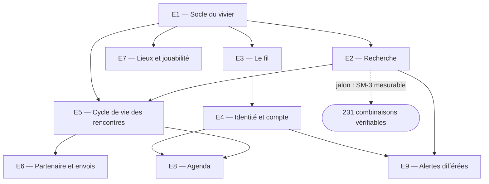

# Ex Aequo — découpage du travail

Comment le travail se répartit, dans quel ordre, et ce que chaque lot touche. Ce n'est pas
encore la liste des épiques et des stories — c'est la vue qui permet de la produire, et
c'est `bmad-create-epics-and-stories` qui la formalisera.

Le découpage suit la frontière posée par **AD-1**. Les cinq premiers lots ne contiennent
**aucun appel au LLM** : ils sont testables au sens strict, contre les chiffres que le PRD
compte lui-même.

## L'ordre, et pourquoi

Deux propriétés de cet ordre méritent d'être dites.

**E1 et E2 forment un premier jalon qui vaut la peine.** À leur terme, le moteur
d'appariement complet existe, sans une ligne de LLM ni de web — et **SM-3 devient mesurable**
directement : les 231 combinaisons se parcourent en boucle, les 127 vides se comptent, et le
plancher de 85 % que le PRD fixe se vérifie. C'est le seul critère de réussite du produit qui
soit chiffrable par un test, et il est atteignable en premier.

**E3 est le seul lot vraiment nouveau.** Tout le reste est du logiciel ordinaire ; l'agent,
le flux SSE et le contrat d'événements sont l'endroit où le projet apprend quelque chose. Le
placer après E1–E2 fait qu'il arrive sur un domaine déjà juste, donc qu'un comportement
étrange s'impute au câblage et non aux règles.

## Les lots

### E1 — Socle du vivier
**Gouverné par :** AD-1, AD-5, AD-11, AD-16
**Touche :** `domaine/vivier`, `domaine/sports`, `adaptateurs/secondaires/persistance`, `amorcage/`

Les entités, le schéma, la clé de sport normalisée et sa table de synonymes, la distinction
des deux populations, la provenance des numéros, et le chargement idempotent des 86 profils.

*Fait quand* : relancer l'application ne duplique rien, et les 11 sports du fichier
produisent 11 clés — pas 12.

### E2 — Recherche
**Gouverné par :** AD-1, AD-5, AD-6
**Touche :** `domaine/recherche`

L'égalité stricte de niveau, l'élargissement sur le jour et sur lui seul, le plafond de trois
candidats, le tri par délai d'attente croissant avec l'ordre du vivier à égalité, l'exclusion
du niveau inconnu, l'exclusion de soi-même.

*Fait quand* : SM-3 se mesure et passe. Les deux paires Pilates ressortent vides, et le
scénario « Tennis, mardi, débutant » renvoie Emma Leroy.

### E3 — Le fil
**Gouverné par :** AD-2, AD-3, AD-4, AD-17, AD-20, AD-21
**Touche :** `adaptateurs/primaires/web`, `adaptateurs/primaires/agent`

Le flux SSE et ses quatre événements, la boucle *tool runner*, l'émission des étapes par la
couche d'outil, le fil append-only, le cookie de 30 jours, le rendu des blocs, les primitives
d'interaction, la panne du modèle.

*Fait quand* : une recherche complète se déroule dans le fil, le signe de vie part en moins
de deux secondes, et couper le réseau au milieu d'un tour produit un message qui nomme la
panne et dit ce qui n'est pas perdu.

### E4 — Identité et compte
**Gouverné par :** AD-18, AD-21
**Touche :** `adaptateurs/primaires/web`, `domaine/vivier`

Les deux parcours OAuth, la première portée seulement, l'attachement de la conversation en
cours au compte, le retour au même endroit avec le brouillon intact, l'entrée au vivier à la
création du compte, le remplacement de sport et son écriture atomique.

*Fait quand* : se connecter en milieu de fil ne perd rien et n'ouvre pas un second fil.

### E5 — Cycle de vie des rencontres
**Gouverné par :** AD-6, AD-7, AD-8, AD-9, AD-15
**Touche :** `domaine/rencontre`, `adaptateurs/primaires/horloge`

Les cinq statuts et la table de transitions, les effets attachés aux arêtes, la dérivation du
jour bloqué et sa symétrie, la précondition d'une seule recherche active et son asymétrie, la
transaction unique de la validation, la tâche périodique d'expiration.

*Fait quand* : deux onglets ne produisent pas deux rencontres ; un abandon libère le jour des
**deux** profils ; être sollicité par un autre demandeur n'empêche pas de chercher.

### E6 — Partenaire et envois
**Gouverné par :** AD-8, AD-10, AD-11, AD-12
**Touche :** `domaine/envoi`, `adaptateurs/secondaires/envois`, `adaptateurs/primaires/web`

Le filtre de destinataire, la boîte d'envoi et sa page locale, le jeton opaque, la page
d'acceptation et ses sept états terminaux, le conflit de créneaux, la sortie définitive du
vivier.

*Fait quand* : le scénario de démonstration de l'addendum s'exécute — le lien ouvert dans un
second onglet, rechargé après un abandon, affiche l'état *rencontre abandonnée* et propose la
sortie du vivier.

### E7 — Lieux et jouabilité
**Gouverné par :** AD-13, AD-14, AD-19
**Touche :** `domaine/jouabilite`, `adaptateurs/secondaires/{lieux,meteo,air}`

Data ES et le filtrage lyonnais, la projection de `equip_nature`, Open-Meteo, l'API ATMO et
son inscription, les trois seuils, les deux horizons, la contre-proposition d'heure.

*Fait quand* : un lieu **pleinement intérieur** ne déclenche aucune mention météo ; un créneau à
cinq jours rend les deux premiers seuils et **nomme** celui qu'il n'a pas pu établir.

> *Corrigé le 2026-08-31.* Ce critère disait « un lieu **couvert** ». Lu avec le vocabulaire du
> produit, il énonçait l'inverse d'**AD-14** : « couvert » ne suffit précisément pas à désactiver
> la jouabilité, et Data ES retourne littéralement la valeur `Extérieur couvert`. Un constructeur
> qui n'aurait lu que ce critère aurait implémenté l'inversion que l'invariant a été écrit pour
> empêcher — et son test serait passé.

### E8 — Agenda
**Gouverné par :** AD-9, AD-13, AD-18
**Touche :** `adaptateurs/secondaires/agenda`

Le second consentement OAuth, le choix Google ou Outlook, l'écriture après confirmation
explicite, la mise à jour sur changement de statut, l'absence de tout numéro dans
l'événement.

*Fait quand* : un abandon met l'événement à jour **sans** envoyer de courriel.

### E9 — Alertes différées
**Gouverné par :** AD-5, AD-12, AD-15
**Touche :** `domaine/alerte`

Le déclenchement à l'écriture d'un profil — pas seulement à la création d'un compte —, la
correspondance exacte, les alertes multiples simultanées, l'annulation depuis la conversation,
l'expiration à 60 jours.

*Fait quand* : un utilisateur existant qui change de sport déclenche l'alerte de quelqu'un
d'autre, au même titre qu'une inscription.

## Ce qui peut avancer en parallèle

**E7 ne dépend que d'E1.** Les trois adaptateurs tiers, la projection de `equip_nature` et
les seuils s'écrivent et se testent sans le fil, sans compte et sans rencontre. C'est le seul
lot substantiel qui se détache franchement du chemin critique — utile si l'inscription à
l'API ATMO traîne, puisqu'elle est la seule démarche du projet.

**E6 et E8 se rejoignent tard.** Tous deux réagissent aux transitions d'E5 mais ne se
touchent pas : ils n'ont en commun que la table d'arêtes d'AD-9, qui est écrite dans E5.

Le reste est en ligne. Pour un constructeur seul, la vraie contrainte n'est pas le
parallélisme mais l'ordre : **E1 → E2 → E3** avant tout le reste, parce que ces trois lots
établissent respectivement que les données sont justes, que les règles sont justes, et que le
câblage est juste — dans cet ordre, chaque erreur trouvée n'a qu'une cause possible.

## Ce qui n'est dans aucun lot

Hors périmètre MVP et sans épique : le parcours conversationnel côté partenaire (QO-2), la
réservation de terrain, la calibration du niveau, le multi-sport, le signal d'équilibre après
rencontre, et tout ce qui suit le créneau. Hors enveloppe technique : le déploiement, les
secrets managés et un fournisseur SMS réel — voir la section *Deferred* de la spine.
